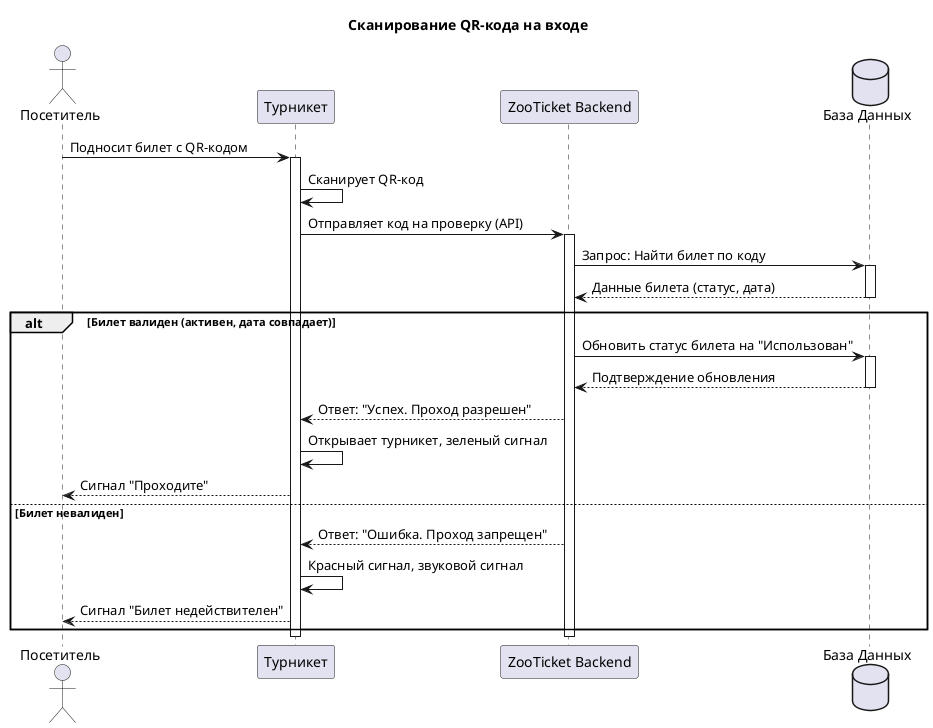
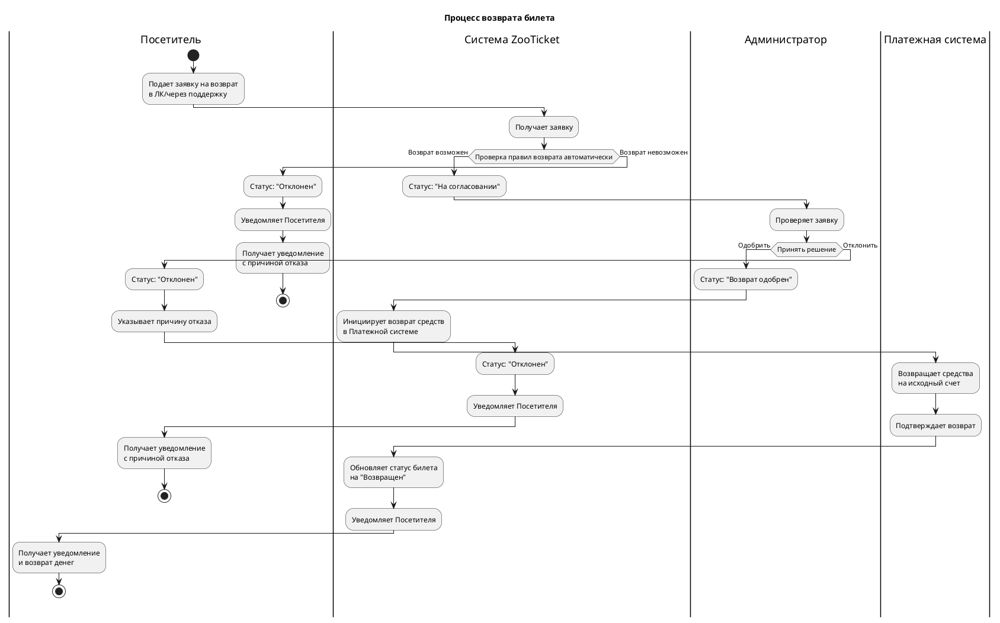

# Модуль 3: Моделирование процессов ZooTicket

## Задание
Построить диаграммы:
1. **Последовательности (Sequence Diagram)** для сценария «Сканирование QR на входе»
2. **Деятельности (Activity Diagram)** для сценария возврата билета

---

## 1. Диаграмма последовательности: Сканирование QR на входе

### Описание сценария
Посетитель подходит к турникету, сканирует QR-код с билета. Система проверяет валидность билета и открывает турникет при успешной проверке.

### Код диаграммы (PlantUML)
Сохраните этот код в файл `sequence-diagram.puml`:


### Описание потока событий

| Шаг | Действие | Участники |
|-----|----------|-----------|
| 1 | Посетитель подносит билет к турникету | Посетитель → Турникет |
| 2 | Турникет сканирует QR-код | Турникет |
| 3 | Отправка кода на проверку в бэкенд | Турникет → Backend |
| 4 | Поиск билета в базе данных | Backend → БД |
| 5 | Получение данных билета | БД → Backend |
| 6 | **При успехе**: обновление статуса, открытие турникета | Backend → Турникет → Посетитель |
| 7 | **При ошибке**: отказ в доступе | Backend → Турникет → Посетитель |

---

## 2. Диаграмма деятельности: Процесс возврата билета

### Описание процесса
Посетитель подаёт заявку на возврат билета. Система проверяет возможность возврата по правилам, затем заявка направляется администратору на рассмотрение. В зависимости от решения происходит возврат средств или отказ.

### Код диаграммы (PlantUML)
Сохраните этот код в файл `activity-diagram.puml`:


### Бизнес-правила возврата

| Правило | Описание |
|---------|----------|
| **Срок возврата** | Возврат возможен не позднее чем за 24 часа до даты визита |
| **Статус билета** | Возврат возможен только для неиспользованных билетов |
| **Тип билета** | Специальные тарифы могут иметь ограничения на возврат |
| **Комиссия** | При возврате может удерживаться комиссия |

### Статусы билета в процессе возврата

| Статус | Описание |
|--------|----------|
| **Активен** | Билет действителен, не использован |
| **На согласовании** | Заявка на возврат ожидает решения администратора |
| **Одобрен** | Возврат одобрен, ожидается возврат средств |
| **Возвращен** | Средства возвращены, билет недействителен |
| **Отклонен** | В возврате отказано (по правилам или решению администратора) |

---

## 3. Инструкция по просмотру диаграмм

### Способ 1: Онлайн (самый простой)
1. Перейдите на [PlantUML Online Server](http://www.plantuml.com/plantuml/uml/)
2. Скопируйте код диаграммы из файлов выше
3. Вставьте в левое поле
4. Нажмите "Submit"
5. Сохраните полученное изображение (опционально)

### Способ 2: В VS Code
1. Установите расширение "PlantUML"
2. Откройте `.puml` файл
3. Нажмите `Alt+D` для просмотра
 
### Способ 3: Локально через Java
```bash
# Установите Java
# Скачайте plantuml.jar с официального сайта
java -jar plantuml.jar sequence-diagram.puml -tpng
```
---

## 4. Примеры визуализации

### Диаграмма последовательности (схематично)
```
Посетитель → Турникет : Подносит QR-код
Турникет → Backend : Проверка кода
Backend → БД : Запрос билета
БД → Backend : Данные билета
Backend → Турникет : Результат проверки
Турникет → Посетитель : Сигнал (проход/отказ)
```

### Диаграмма деятельности (схематично)
```
Подача заявки → Проверка правил → Возврат возможен?
→ Да → На согласование → Решение администратора
→ Одобрено → Возврат средств → Уведомление
→ Отказ → Уведомление с причиной
→ Нет → Отказ → Уведомление с причиной
```

---

## 📌 Вывод

Построенные диаграммы наглядно описывают ключевые процессы системы ZooTicket:

- **Sequence Diagram** детализирует техническое взаимодействие компонентов при проходе через турникет, показывая последовательность сообщений между посетителем, турникетом, бэкендом и базой данных.

- **Activity Diagram** моделирует бизнес-процесс возврата билета с участием всех сторон (посетитель, система, администратор, платежная система), отображая ветвления и возможные исходы.

Обе диаграммы являются важной частью документации и помогают команде разработки понять требования к системе на этапе проектирования.
